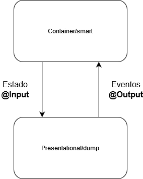

# Angular

Angular es una plataforma enorme y variada, un marco de trabajo estructural. El
core de Angular es un framework de estructura, busca a través de *directivas*
estructurar una aplicación, agregando funcionalidades a elementos del DOM.
Angular 18 ha supuesto un cambio muy importante al quedar deprecados los
módulos, ya no es necesario declarar un componente en un módulo, para pasar a
usar *standaralone componentes*.

<center>

| Ventajas | Desventajas |
| -------------- | --------------- |
| Opinado | Complejo |
| Robusto | Poco flexible |
| Estructurado | Verboso |

</center>

## Estructura de ficheros

- package.json → Documento para el gestor de dependencias.
- angular.json → Documento de configuración de angular.
- .editorconfig → Le dice al editor cómo trabajar con el código, lo usan los
formaters.
- main.ts → Donde arranca la aplicación.
- app.routes.ts → Para el enrutado de Angular.
- dist → Es la distribución de angular una vez montado.
- app → Contienen los componentes de la aplicación y es una buena practica
colocar los diferentes componentes hasta el nivel donde se utilizan, haciendo
así que la propia estructura de carpetas refleje la estructura de la UI.

## Detección de cambios
En la propagación despues de un evento en un componente por defecto se
comprueban todos los nodos, para evitar esto existen atributos que modifican
este comportamiento. Por ejemplo `OnPush` hace que unicamente se comprueben los
cambios si se altera un aparametro del componente o se lanza un evento propio.

Existe una forma de que se notifiquen entre nodos del DOM sin que los elementos
de en medio se vean alterados, un estado compartido que afecta unicamente a los
afectados directos. En el nuevo Angular esta forma son los *signals*. Aun así
esto es muy nuevo y en la mayoría de proyectos se usa zonejs para compartir
estado, no *signals*.

## Directivas
Una *directiva* es la posibilidad de aumentar la funcionalidad de algo que no lo
poseía en un principio. Por ejemplo, un componente es una clase de js con un
decorador de ts. Existen diferentes tipos de directivas:

- Directivas de atributo. Que aparecen rodeadas de `[ directiva ]` y sirven para
  modificar etiquetas. Dos muy comunes son `ngStyle` que añade un estilo y
`ngClass` que añade un atributo clase para alterar y estilo css. A estas
directivas se les puede añadir una condición para alterar el estado visual
dependiendo de un parametro.

```html
<div [ngStyle]="{color: condition ? 'blue' : 'red'}"> Style </div>
<div [ngClass]="condition ? 'green' : 'red'"> Class </div>
```

- Directivas estructurales. Se presentan `*directiva` sirven para decidir si
algo se renderiza o no en pantalla. `ngIf` es la directiva estructural más
comun. ***Importante, si algo no está renderizado no se ve en pantalla solamente
sino que no ocupa memoria directamente.***

```html
<div *ngIf="condition"> Yo me renderizo </div>
```

Angular "por detras" implementa un lógica basada en su etiqueta propia:
`<ng-template>`, que permite renderizar grandes cantidades de elementos o
estructuras de UI más complejas de una forma más elegante. En relación con esto,
y fijandonos en React, exite otra etiqueta, `<ng-container>` que hace las veces
de "fragment", esta etiqueta no se renderiza. Estas dos etiquetas usadas de
manera combinada son muy poderosas, usando el atributo `ngTemplateOutlet` de
`<ng-container>`.

```html
<ng-template[ngIf]="condition">
    <div>Yo me renderizo</div>
</ng-template>
```

Otra directiva estructural fundamental es `ngFor` que nos permite iterar sobre
unos datos para mostrarlos en pantalla. Es en este momento en el que
`ng-template` cobra más sentido. Cómo en este ejemplo, para evitar renderizar
etiquetas incesarias de contendores o *para aplicar a una estructura de
elementos logicas complejas con multiples directivas estructurales*

> [!IMPORTANT]
> No se pueden poner dos directivas estructurales en la misma etiqueta.

```html
<ul>
  <li *ngFor="let item of array"> {{item}} </li>
</ul>

<ul>
    <div *ngFor="let item of array">
        <li> {{item}} </li>
    </div>
</ul>
<!-- Aquì unicamente aparece en el dom el li-->
<ul>
    <ng-container *ngFor="let item of array">
        <li> {{item}} </li>
    </ng-container>
</ul>

<ul> <!-- Esto no se puede hacer --> <li *ngFor="let item of array"> {{item}}
    *ngIf="condition"</li> </ul>

<ul> <!-- Así optenemos la funcionalidad que queriamos --> 
    <ng-container *ngFor="let item of array"> 
        <li *ngIf="condition"> {{item}} </li>
    </ng-container> 
</ul>
```

La directiva `ngFor` podemos pasarle diferentes parametros. Con `let` podemos
crear una variable o controlar el bucle de una morma más finas mediante
plalabras clave (last, even, first, index) y con `trackBy` podemos asignarle una
función que servirá para diferenciar dos elementos iguales, propiedad del
`ngFor` que ayuda sustancialmente al rendimiento.

```html
<ul>  
    <ng-container *ngFor="let item of array; let i = index"> 
        <li *ngIf="i > 22"> {{item.name}} </li>
    </ng-container> 
</ul>

<ul>  
    <ng-container *ngFor="let item of array; let i = index"> 
        <li *ngIf="even"> {{item.name}} </li>
    </ng-container> 
</ul>
```

Otra directiva poderosisima para conseguir una web dinamica y veloz es
`ngSwitch`. Funciona cómo la estructura de control analoga, renderizando
unicamente la opción seleccionada. En el ejemplo de abajo usamos además la
directiva `[ngTemplateOutlet]`.

```javascript
export class MiComponente {
  opcion: string = 'uno';
}
```

```html
<div [ngSwitch]="opcion">
    <ng-container *ngSwitchCase="'uno'">
        <ng-container *ngTemplateOutlet="templateUno"></ng-container> 
    </ng-container>
    <!-- Se omiten más opciones -->
</div>

<!-- Definición de los templates -->
<ng-template #templateUno>
  <p>Este es el contenido del template UNO.</p>
</ng-template>
```

## Defer block

Es parte de las novedades de Angular 17 y permite cargar de manera ralentizada
ciertos componentes de la interfaz. Requiere un "trigger" para saber cuando
cargar. Se le pueden poner condiciones adicionales cómo un `@placeholder` para
el contenido predeterminado o un tiempo minimo con `@loading`.

```typescript
@defer (on viewport) {
    <components />
} @placeholder {
    <span>NADA</span>
} @loading (minimum 2s) {
    <span>Cargando</span>
}
```

## Patrón container-presentational o smart-dump

En una frase es un patron que tiene un componente padre cómo contenedor del
componente hijo que efectua el renderizado de información.

En un estado inicial de nuestro proyecto, en su forma más simple, cómo
representamos una funcionalidad es un unico componente que, aun estando
constituido por diferentes archivos, es una unidad de: lógica, presentación y
eventos.

<center>

 

</center>

Aplicando el patrón tenemos dos componentes, el contenedor contine la lógica del
estado, estado que pasa al componente presentacional para mostrarla, cuando el
usuario interactua con la vista, el componente presentacional lanza un evento al
contenedor. El componente presentacional es abnostico al contexto, es muy facil
de reutilizar en el mismo proyecto u otro. Este patrón vuelve el frontend más
resiliente.

## Referencias.
1. [Lista de reproducción Angular - Gentleman Programming](https://youtube.com/playlist?list=PL42UNLc8e48RINrNGumxAKulG5CWgs_yv&si=7zsJgqIDEgIVHGtT) 
2. [Patrón container/presentational](https://www.youtube.com/watch?v=0XmZeRnlBjY) 
