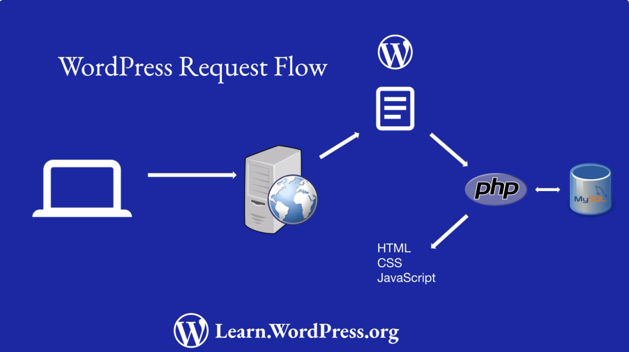

# Wordpress
## ¿Qué es wordpress?
Wordpress es una aplicación web que corre en un servidor, wordpress funciona
sobre LAMP: Linux, Apache MySQL y PHP.

 

Cuando un usuario visita una URL en un sitio de WordPress, ocurre lo siguiente:
1. El navegador envía una solicitud al servidor web para obtener los datos de la
URL ingresada. 
2. El servidor web recibe la solicitud y decide qué archivo ejecutar
para servir los datos. 
3. En un sitio de WordPress, será el archivo `index.php` en el
directorio raíz para solicitudes del front-end, o un archivo específico en
`wp-admin` para solicitudes de administración. 
4. El intérprete PHP ejecuta el código PHP. 
5. Si es necesario, el código PHP interactúa con la base de datos MySQL para
obtener datos. 
6. El código PHP genera código HTML, e incluye el CSS o JavaScript
relevante. 
7. El servidor web envía el HTML, CSS y JavaScript al navegador. 
8. El navegador renderiza el contenido y muestra la página al usuario.

## Estructura de ficheros de wordpress
Los ficheros y carpetas relevantes de wordpress son:
1. Carpetas raiz
    - wp-admin/ → Contiene todo el código de la pantalla de administrador.
    - wp-content/ → Contiene todos los archivos que pueden ser añadidos a un
    sitio wordpress, todo loq ue un plugin necesite almacenar se guarda aquí
    igualmente.
    - wp-includes/ → Contiene el core de la aplicación wordpress y todas sus APIs.
1. Ficheros estáticos
    - .htaccess → Configura Apache para una versión específica de wordpress.
    Nginx no soporta este tipo de configuración, debe hacerse en el propio
    archivo del "block".
2. Ficheros de lógica dentro ejecución normal de wordpress (peticiones)
    - index.php → Es el archivo que se ejecuta cuando una petición es redirigida
    a la raiz. Incluye el archivo `blog-header.php` que a su vez incluye
    `wp-load.php` que a su vez incluye `wp-config.php`. 
    - wp-config.php → Es el archivo principal de configuración de wordpress e
    incluye el archivo `wp-settings.php`.
    - wp-settings.php → Configura las funcionalidades básicas de wordpress.
3. Ficheros php fuera de la ejecución normal de wordpress
    - wp-activate.php → Envia la clave de activación a un usuario cuando se crea
      un nuevo sitio. Se usa cuandos e instala la aplicación o si se manejan
    muchos sitios web, una instalación multiple.
    - wp-comments-post-php → Procesa los comentarios enviados a la web.
    - wp-cron.php → Ejecuta tareas programadas cada vez que se soicita una página en el sitio.
    - wp-links-opml.php → Deprecado. No lo necesitamos para
    compativilidad.
    - wp-login.php → Formulario de inicio de sesión.
    - wp-mail.php → Gestiona las funcionalidades de enviar publicaciones
    por correo de wordpress.
    - wp-signup.php → No es relevante, para instalaciones multiples.
    - xmlrpc.php → Procesa solicitudes XML-RPC utilizado por la aplicación
    movil de wordpress. Se deve desactivar si no se usa.

## Desarrollo
En wordpress trabajamos con entornos de desarrollo autocontenidos. En WP se
suelen usar servidores proxis de la página en produción, para trabajar sobre
ellos sin comprometer el entorno de producción. Por otro lado tenemos los
entornos locales, la forma más moderna es usando un contenedor de Docker. La
comunidad de WP ha construido también muchas soluciones para el trabajo en local
que están lista fuera de la caja. Todos estos entornos nos permiten integrar
facilmente Git y tener una mejor experiencia de desarrollo.

### Entorno local de desarrollo
Existen diferentes opciones listas para usar como: Local, MAMP, XAMPP, etc. Son
rápidos de usar, pero requieren una instalación muy pesada, no permiten aislar
la instalación de WP del desarrollo, para gestionar varios desarrollos puede
suponer problemas que se suponen evitas con estas soluciones prehechas. Además
hay un inconveniente de método, estos entornos suponen una abstracción inicial
del entorno sobre el que se está desarrollando, cosa que limita la comprensión
de lo que estamos haciendo *realmente*.

### [wp-env](https://www.npmjs.com/package/@wordpress/env)
Esta herramient escrita en javascript (necesita node) permite levantar un
entorno local rápido basado en Docker (necesita docker). `wp-env` genera los
ficheros en el directorio `~/.wp-env`, que contiene una subcarpeta por cada
proyecto, que se montan en el contenedor docker subyacente. Se puede configurar,
hasta cierto punto, la instalación en el archivo `.wp-env.json`, para
configuraciones muy específicas lo mejor es usar Docker directamente. Los
comandos más relevantes son:

**wp-env start** 
Installa e inicializa un entrono de WordPress, este comando unicamente
reconfigurará el entorno si el archivo de conficuración cambia. Por defecto el
la URL es localhost, el puerto 8888, el puerto de test 8889, el usuario es
admin, la contraseña password, el usuario de la base de datos root y la
contraseña password.

**wp-env run**
Permite pasar comandos de shell a los contenedores subyacentes.

> [!IMPORTANT] Si existe conflicto con uno de los comadnos propios de wp-env
> puede usarse `--` para saltar el comando de wp-env.

```text
wp-env run <container> [command...]
```

## Temas
Los temas controlan la presentación mientras que los plugins el comportamiento.
A la hora de desarrollar un tema debemos prestar atención a: colores, layout,
fuentes y funcionalidades, cuando hablamos de esto último, no nos referimos a
lógica cómo la de una pasarela de pago, sino a un header personalizable, etc.

Existen tres topos de tema:
- Los temas de bloques: usan los bloques de wordpress (componentes) para
construir todos los elementos d ela interfaz. Predominan los archivos
javascript. Dan más libertad al editor para cambiar los diferentes elementos de
la presentación.
- Los temas clásicos: no usan el editor de bloques para gestionar el sitio más
allá de páginas y entradas, predominan los archivos php.
- Los temas hibridos: es un téma clásico que permite editar algunas
caracteristicas de la presentación mediante bloques.

### Estructura de un tema

Para el modelo de tema actual, el de bloques la estructura de ficheros es la
siguiente:
- assets/
    - css
    - fonts
    - img
    - js
- parts/ → Partes reutilizables en templates: cabecera, barra lateral, pie, etc.
- patterns/ → Ficheros PHP. Componentes reutilizables compuestos por uno o más
bloques que el usuario de wordpress puede usar en el editor de wordpress para
personalizar la vista de una entrada o una página.
- styles/ *necesario* → Contiene los estilos.
- templates/ → Ficheros html que representan la estructura del frontend, son
componentes marcados con la etiqueta bloque de wordpress.
    - index.html *necesario*
- functions.php
- screenshot.png
- theme.json → Configuración para integrar mejor el tema con wordpress

### Temas hijo
Un tema hijo es una extensión de un tema existente, permite modificar la el tema
padre sin alterar el código original, por ejemplo cambiando el layout de uno de
los bloques del tema o toda la estructura de un template.

Para crear un tema hijo simplemente debe añadirese a la carpeta themes/ una
nueva carpeta con un archivo style.css con una cabecera especial en forma de
comentario. Heredará autoamticamente todos los contenidos del tema declarado
cómo padre.

```css
/**
* Theme Name: Tema hijo
* Template: Tema padre
*/
```
Para alterar un archivo del padre, se debe crear un archivo que imite la
estructura de ficheros y el nombre del archivo a modificar en el tema padre.

## Plugins
Un plugin es un paquete de código que añade funcionalidades a wordpress, algunos
se usan para controlar el "look and feel" de un sitio wordpress, otros añaden
nueva lógica y funcionalidades.

A la hora de añadir funcionalidades relacionadas con un tema, puede añadires al
archivo `functions.php`, pero esto hace que esa lógica quede acoplada con a
estetica del tema, es de valorar si sería mejor separarlo en un plugin que se
pueda usar independientemente del tema.

Para crear un plugin unicamente hace falta un archivo php, con la cabecera
necesaria, en la carpeta plugins de wordpress. Para funcionalidades más
complejas, se puede ordenar el codigo en un carpeta dentro de plugins con un
archivo principal que incluya el resto de archivos nesarios. Wordpress
almacenará cómo identificador de cada plugin el nombre dle archivo php o de la
carpeta que contenga el código.

```php
<?php
/*
 * Plugin Name: Ejemplo de plugin básico
 */
// El resto de headers: https://developer.wordpress.org/plugins/plugin-basics/header-requirements/

echo "Hola mundo"
?>
```

## Blocks
Los bloques son la forma en la que wordpress almacena y repepresenta contenidos.
Los bloques se usan en los editores de post y págnias cuando se edita cotnenido,
cómo en el editor del sitio cuando se trabaja con plantillas, en definitiva
el editor Gutenberg de wordpress. **Los bloques son HTML con comentarios y
estiquetas específicas. Son componentes, de hecho usa React por debajo.**


## Referencias
1. [Docker Setup for Local WordPress Development](https://www.youtube.com/watch?v=GG2k-La5t3o)
2. [Easy Local WordPress Setup in 5 Minutes with Docker](https://www.youtube.com/watch?v=gEceSAJI_3s)
3. [Beginner Wordpress developer](https://youtube.com/playlist?list=PL1pJFUVKQ7ETYqC5F_z4BOJ4FoT7xZy_u&si=vZdTL8vn62R3X9IJ)
4. [Plugin Handbook](https://developer.wordpress.org/plugins/)
5. [@wordpress/env](https://developer.wordpress.org/block-editor/reference-guides/packages/packages-env/#add-mu-plugins-and-other-mapped-directories)
